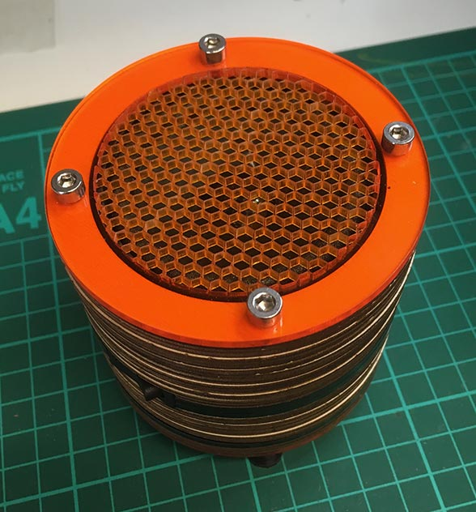
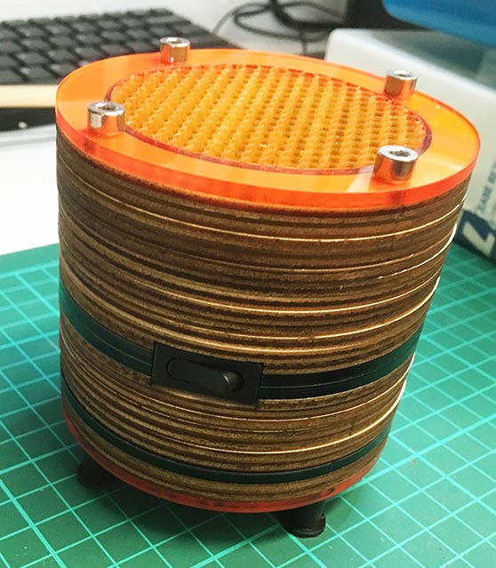
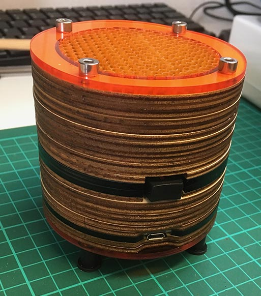
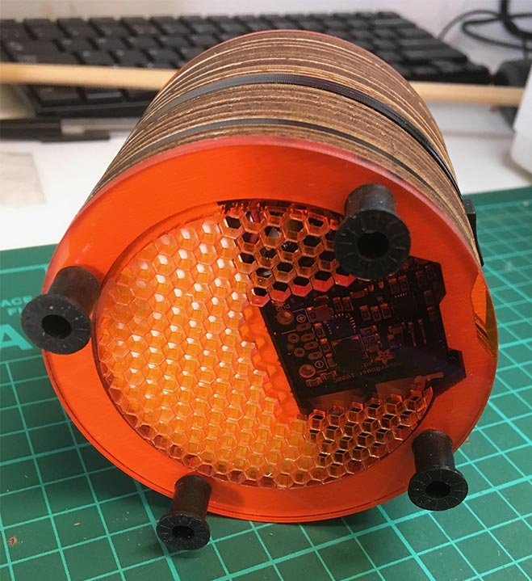

# audioNodes
Raspberry Pi based Smart Speaker Network designed to run Pure Data patches for sonic arts. 

- small and fairly powerful with good audio quality (I2S 3W amplifier)
- contains a Lipo battery and manages charging via USB micro
- has a smart power switch (safe shutdown and power off)
- everything shared here under Creative Commons Attribution-ShareAlike 4.0 International License, the Raspberry Pi image *, laser cut designs, code and circuit designs. The safe shutdown circuitry and code are inspired by the NeonHorizon/lipopi repo which is covered by a GPL 3.0 licence. Go forth and prosper...

 This work is licensed under a <a rel="license" href="http://creativecommons.org/licenses/by-sa/4.0/">Creative Commons Attribution-ShareAlike 4.0 International License</a>.

The idea is to run audio nodes that can communicate with each other using OSC in PD and eventually add sensors and microphone input (and possibly some extra output functionality). The hardware is a development from my digital 'birds' installation: https://www.dotlib.org/home#/forest-of-imagination-2018/

This project is at an early stage and the documentation is not yet as clear as it could be, I have just taken on a new full time job and am not sure when I can next update it or add details on the OSC communication part. Happpy to accept any help in this respect!

To build your own, check out the BOM (bill of materials) spreadsheet for required components and follow the 'Building an Audio Node' document with reference to the 'build stage photos' and notes. The lasercut designs make use of a deep engrave to go around some of the components, you will have to work this out based on your material and laser cutter model.

* Raspberry Pi image can be download from here: https://www.dropbox.com/s/5uapjz6rh7yxo8m/raspbianImage.img.zip?dl=1
